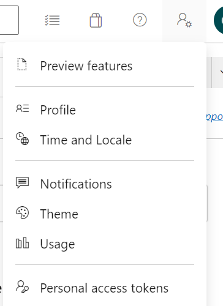
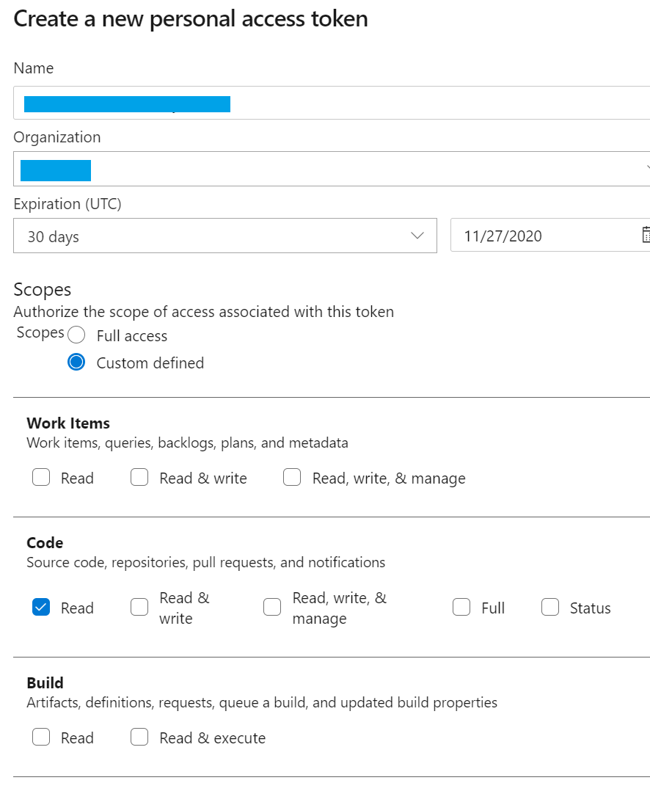
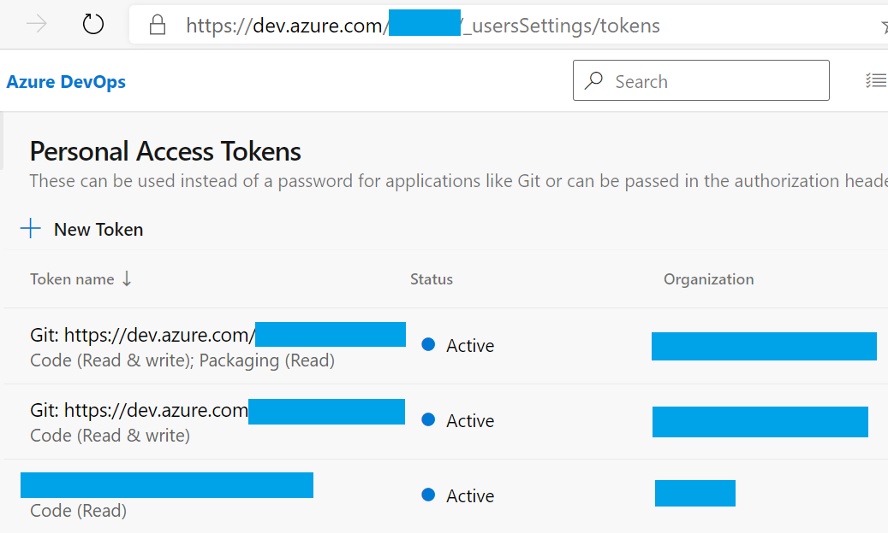
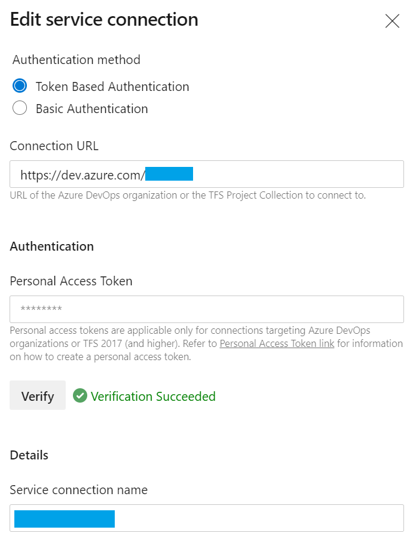

# Creating and Configuring a Personal Access Token (PAT)

This document is a guide on how to create a personal access token that has only Code Read privilege assigned, following the [Principle of least privilege](https://en.wikipedia.org/wiki/Principle_of_least_privilege).  

1. Go to the Azure DevOps organization where the template is stored. On the Azure DevOps page, the token is created from the `User Settings` menu:

    

2. Selecting a `Custom defined` `Scope` for the token that only allows `Read` access to repositories in the targeted organization where you will be running your pipeline from.

    

3. The token is shown in the list of available tokens for the user that created it.

    

## Configuring a service connection to a repository in another organization

1. After the PAT is created, we can now create the service connection in the `Project Settings` for the organization with the "calling" pipeline:

    

2. The service connection can be configured to access the other organization with token based or basic  (username / password) authentication.

    
